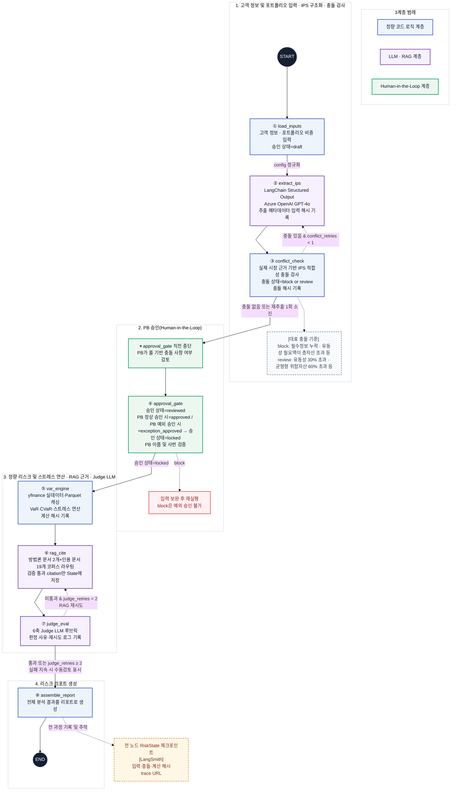

# S.ymphony

**LangGraph 기반 재현가능·설명가능 리스크 리포트 엔진**
삼성증권 영크리에이터 15기 4조 · 과제2



## 문제 정의

고금리·강달러 국면에서 PB가 고액 자산가 고객에게 리스크 리포트를 제시할 때,
같은 입력에도 매번 다른 수치가 나오거나(재현 불가) 근거를 대지 못하면(설명 불가)
신뢰가 무너진다. 예시 페르소나: **50대 자영업자, 위탁자산 50억, 6개 자산군 분산**.

S.ymphony는 이 문제를 두 축으로 해결한다.

- **재현가능성** — VaR·CVaR·스트레스 계산을 결정론(numpy/scipy) 계층으로 격리하고
  시드를 고정(`seed=42`), 결과에 `computation_hash`를 남겨 "같은 입력 → 같은 리포트"를 보장한다.
- **설명가능성** — RAG 근거 인용, PB 승인 게이트(HITL), Judge 자동 평가 루프를
  LangGraph 흐름에 배치해 각 수치가 "어디서 왔고 누가 승인했는지"를 추적 가능하게 한다.

### 도구 적정 사용 정당화

**통제가 필요한 곳(분기·승인·루프)엔 LangGraph를, 재현이 필요한 곳(수치 계산)엔
결정론 엔진을** 분리 배치한다. LangGraph는 상충 재추출 분기·PB 승인 게이트·judge
평가 루프처럼 조건부 제어와 역추적이 필요한 지점에만 쓴다. 반대로 VaR·CVaR 계산과
리포트 조립은 LLM·오케스트레이션이 불필요한 결정론 구간이므로 순수 numpy·단순
함수로 처리한다. `app/engine/`에서는 langchain·openai import를 금지하고, LLM 호출은
`app/llm/` + 노드 계층에서만 한다(LangChain retriever·Structured Output 표준 부품만
사용, 원시 API 직접 호출 금지).

## 아키텍처

노드 8개 · 조건부 분기 2개(① 상충 재추출 ② judge 평가 루프) ·
HITL 인터럽트 1개(PB 승인 게이트). LLM/결정론/HITL 3계층 표식이 포함된 전체 다이어그램은
[`mermaid.mmd`](mermaid.mmd) 참조.

```
START
  → load_inputs          고객 정보·포트폴리오 입력, 승인 상태 draft
  → extract_ips  ◄─────┐ Azure OpenAI GPT-4o Structured Output, 추출 메타·입력 해시 기록
  → conflict_check ────┘ 분기① 충돌 있고 conflict_retries < 1 → 재추출, 그 외 → 승인
  → approval_gate        ★ HITL: interrupt_before — PB 검토 후 승인(locked), block은 예외 승인 불가
  → var_engine           yfinance 실데이터, Historical VaR·CVaR·신뢰구간·스트레스 3종, 계산 해시
  → rag_cite  ◄────────┐ 코퍼스 21건 category 라우팅, 검증 통과 citation만 저장
  → judge_eval ────────┘ 분기③ 6축 루브릭+인용 감사, 미통과 시 재작성(최대 3회 시도=재작성 2회), 이후 수동검토
  → assemble_report      수치+출처 한 장 병기, 자동 메타(면책·기준일·출처·계산해시·judge 통과 여부)
  → END
```

- 컴파일: `g.compile(checkpointer=MemorySaver(), interrupt_before=["approval_gate"])`
- 노드는 순수 함수로, 변경한 키만 반환한다. 데이터 계약은 `app/state.py`(`RiskState`/`IPSProfile`)가 SSOT.
- `rag_cite`는 상태 기반으로 corpus category를 라우팅한다: `methodology`·`macro`는 항상,
  `house_view`는 CVaR 기여 상위 자산군이 있을 때, `tax`는 IPS에 실질 세무 이슈가 있을 때만.
  Chroma metadata filter 적용 후 원문 부분문자열만 인용하고, 인용 역할·라우팅 사유·발행일을 기록한다.
- `judge_eval`은 잘못된 역할·라우팅을 차단하고, 발행일 누락·6개월 초과 house view는
  수동검토 경고로 남긴다. 재작성 2회 실패 시 수동검토로 전환한다.
- LangSmith는 HITL 전후 trace와 감사정보(trace_id·입력·충돌·계산 해시·프롬프트 해시·
  모델 버전)를 기록해 judge 탈락 항목 역추적과 프롬프트/모델 변경 시 정답률 비교
  (형상관리)를 지원한다. 기본 설정은 입력·출력을 숨겨 상담정보를 외부 trace에 남기지 않는다.
- Judge 평가셋 20건(결정론 15 + Azure LLM 5)으로 judge 정확도를 검증하며,
  `scripts/register_judge_dataset.py`로 LangSmith 데이터셋에 등록한다.

## 기술 스택

| 영역 | 사용 기술 |
| --- | --- |
| 오케스트레이션 | LangGraph (StateGraph, MemorySaver, HITL 인터럽트) |
| LLM | Azure OpenAI GPT-4o (LangChain, temperature=0) — IPS 추출·RAG 인용·Judge |
| 결정론 엔진 | numpy/scipy — Historical VaR/CVaR, 스트레스 테스트 |
| RAG | Chroma + langchain-chroma, 카테고리 라우팅·metadata filter |
| 시장 데이터 | yfinance 실데이터 + Parquet 캐싱 (오프라인 모드 지원) |
| 관측성 | LangSmith 트레이싱 |
| UI | Streamlit (Community Cloud 배포) |
| 협업 | GitHub, Notion, Slack |

## 레포 구조

```
Orchestration/
├── app/
│   ├── state.py       # RiskState/IPSProfile — 팀 데이터 계약(SSOT), 임의 수정 금지
│   ├── graph.py       # StateGraph 조립 (8노드 + 조건부 분기 2개 + HITL 인터럽트 1개)
│   ├── nodes/         # 그래프 노드 8개 (순수 함수, 바꾼 키만 반환)
│   ├── engine/        # 결정론 계층 — langchain/llm import 금지
│   ├── llm/           # AzureChatOpenAI 팩토리, IPS 추출 체인, 감사
│   ├── rag/           # ingest·retriever·citations·배포 검증
│   ├── judge/         # Judge 루브릭·평가
│   ├── observability/ # LangSmith 트레이싱
│   └── utils/         # 해시 등 공용 유틸
├── config/            # config.yaml, ips_policy.yaml, rag_sources.json
├── corpus/            # RAG 문서 21건 (원문 PDF는 로컬 전용, manifest.md 참조)
├── data/              # 시장 데이터·Chroma (gitignore 대상 산출물 포함)
├── docs/              # 정책·평가·배포 문서
├── scripts/           # CLI 진입점·평가·배포 스크립트
├── tests/             # pytest (22개 테스트 모듈)
├── ui/                # Streamlit UI (랜딩·PB 승인·RAG 근거 뷰)
└── .github/           # PR 템플릿·CI·Dependabot
```

## 실행법

### 빠른 시작 (오프라인, 키 불필요)

```bash
python3 -m venv .venv && source .venv/bin/activate
pip install -r requirements.txt
python scripts/run_graph.py --auto-approve --offline
pytest
```

### 실제 실행 (`.env` + 시장데이터 캐시 + Chroma 필요)

```bash
python -m app.rag.ingest              # 코퍼스 인제스트
python scripts/smoke_rag.py           # RAG 스모크 테스트
python scripts/run_graph.py --auto-approve
streamlit run ui/app.py
```

`run_graph.py` 주요 옵션: `--auto-approve`(HITL 자동 승인), `--offline`(더미 데이터),
`--with-conflict`(충돌 시나리오 시연), `--force-judge-fail N`(judge 실패 시연).

### 평가·사전점검

```bash
# 릴리스 사전점검 (API 키 값 미출력)
python scripts/preflight_release.py
python scripts/preflight_release.py --real   # 실제 Azure E2E: 4개 RAG category·검증 인용·Judge·LangSmith trace

# GPT-4o IPS 추출 회귀 평가 (20사례 × 반복 일치율, Azure 키 필요)
python scripts/evaluate_ips_extraction.py --repeats 3

# Judge 평가셋 20건 — 결정론 15건 / Azure LLM 5건 분리
pytest tests/test_judge_eval_evalset.py
RUN_AZURE_JUDGE_EVALSET=1 pytest tests/test_judge_eval_evalset.py
```

pytest에는 위험↑→VaR↑ 방향성 검증(`tests/test_metrics_direction.py`)이 포함된다.

## 설정 (`config/config.yaml`)

| 키 | 값 | 설명 |
| --- | --- | --- |
| `seed` | 42 | 재현성 시드 고정 |
| `as_of_date` | 2026-07-03 | 기준일 |
| `base_currency` | KRW | 기준 통화 (단위·환율 명시) |
| `rf_rate` | 0.0325 | 무위험 수익률 |
| `var_confidence` | 0.99 | VaR 신뢰수준 |
| `horizons` | [1, 10] | VaR 기간(거래일) |
| `var_lookback_days` | 1250 | 관측 기간(약 5년) — 99% 꼬리 관측치 안정성 확보 |
| `data_source` | real | yfinance 실데이터 (`dummy`=오프라인) |
| `strict_citation_gate` | true | 검증 통과 인용 없으면 judge 강제 실패 (제출·시연 기본값) |

## 코퍼스와 로컬 자산

- RAG 문서 **21건** (house_view 6 · macro 7 · tax 6 · methodology 2).
  목록은 [`corpus/manifest.md`](corpus/manifest.md) 참조.
- **원문 PDF는 저작권상 로컬 전용** — git은 폴더 구조(`.gitkeep`)와 manifest만 추적한다.
- 시장·세무 문서는 정량 계산 입력이 아니라 해석 참고로만 사용한다.
- `.env`에 Azure OpenAI·LangSmith 키를 두되 절대 커밋하지 않는다(`.env.example`만 추적).
- `data/chroma/`, 실데이터 parquet는 로컬 전용이다.
- Streamlit 배포에는 private Azure Blob의 검증된 Chroma 아티팩트를 사용한다.

## 과제 요구사항 매핑 (R0–R7)

| 요구사항 | 구현 |
| --- | --- |
| R0-1 StateGraph 8노드+조건부 분기 2개+HITL | `app/graph.py` — 상충 분기·judge 루프(최대 3회) + 승인 게이트 인터럽트(draft→reviewed→locked) |
| R0-2 Mermaid 3계층 표식 | [`mermaid.mmd`](mermaid.mmd) — LLM/결정론/HITL 색상 분리 |
| R0-3 LangSmith 풀스택 | trace·judge 역추적·평가셋 20건+정확도·감사 로그(trace_id+프롬프트 해시+모델 버전)·형상관리 |
| R0-4 LangChain 표준 부품 | RAG retriever(langchain-chroma)·Structured Output, 원시 API 직접 호출 금지 |
| R0-5 도구 적정 사용 정당화 | 위 "도구 적정 사용 정당화" 절 |
| R1 정량 리스크 엔진 | Historical VaR 99% 1일/10일·CVaR·스트레스 3종, KRW 기준, 방향성 pytest |
| R2 RAG 인용 | 코퍼스 21건(≥10), retriever 검색+출처 인용, 수치 옆 근거 병기, `strict_citation_gate` 환각 가드 |
| R3 LLM-as-Judge | judge를 LangGraph 노드로, 6축 루브릭 자동평가, 결함 사유 로그, 평가 루프 |
| R4 결합 리포트 | `assemble_report` — 수치+출처 한 장, 자동 메타(면책·기준일·출처·계산해시·judge 통과) |
| R5 재현성 | seed 고정+parquet 캐시, `computation_hash`(SHA256), LangSmith 감사 로그 병기 |
| R6 3계층 분리 | `app/engine/` LLM import 금지(코드 강제) + mermaid 시각 분리 |
| R7 제출·시연 | Streamlit 시연 — 재현성·승인 게이트·기준일·출처 화면 노출 |

## 문서

| 문서 | 내용 |
| --- | --- |
| [`docs/ips_conflict_policy.md`](docs/ips_conflict_policy.md) | IPS 충돌·예외 승인 기준, 공식 근거, `draft → reviewed → locked` 계약 |
| [`docs/ips_extraction_evaluation.md`](docs/ips_extraction_evaluation.md) | GPT-4o IPS 추출 20사례×3회 실제 평가 결과 |
| [`docs/rag_index_deployment.md`](docs/rag_index_deployment.md) | Chroma 아티팩트 생성·업로드·Secrets 설정 |
| [`docs/streamlit_deployment.md`](docs/streamlit_deployment.md) | Community Cloud 저장소·Python·Secrets·운영 확인 절차 |
| [`AGENTS.md`](AGENTS.md) | AI 코딩 에이전트 공용 컨텍스트·불변 규칙 |

## 브랜치 규칙

- GitFlow: `feature/* → develop → main`
- `main` 직접 커밋 금지, 모든 변경은 PR + 리뷰 1명
- 커밋 메시지는 한국어 `타입: 설명` 형식 (`feat`/`fix`/`docs`/`chore`/`refactor`/`test`)
- 푸시 전 `python scripts/run_graph.py --auto-approve` 완주와 `pytest` 통과 확인
